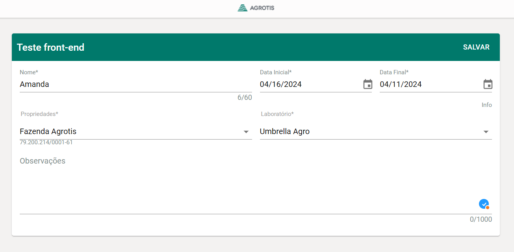

## Test Front-End


### About Project:

The project consists of building a simple form using React, where the objective is to follow a provided prototype. In addition to demonstrating my skills skills as a front end developer.




### Technologies
Built using [React JS](https://pt-br.reactjs.org/) with [Vite JS](https://vitejs.dev/), this interface and the layout were made from scratch by me.

- [@emotion/react](https://www.npmjs.com/package/@emotion/react): ^11.11.4
- [@emotion/styled](https://www.npmjs.com/package/@emotion/styled): ^11.11.5
- [@mui/icons-material](https://www.npmjs.com/package/@mui/icons-material): ^5.15.15
- [@mui/material](https://www.npmjs.com/package/@mui/material): ^5.15.15
- [@mui/x-date-pickers](https://www.npmjs.com/package/@mui/x-date-pickers): ^7.3.1
- [dayjs](https://www.npmjs.com/package/dayjs): ^1.11.10
- [formik](https://www.npmjs.com/package/formik): ^2.4.6
- [lodash.get](https://www.npmjs.com/package/lodash.get): ^4.4.2
- [react](https://www.npmjs.com/package/react): ^18.2.0
- [react-dom](https://www.npmjs.com/package/react-dom): ^18.2.0
- [react-query](https://www.npmjs.com/package/react-query): ^3.39.3
- [yup](https://www.npmjs.com/package/yup): ^1.4.0

## 🚀 Getting Started

### Prerequisites
- Node 16 or 16^
- Git 2

### Install project

```bash
git clone git@github.com:amand4/forms-agrotis.git
cd forms-agrotis
npm install
```

### Start project
To start the project, run the following command:

```bash
npm run dev
```

Open http://localhost:5173 to view it in the browser.

